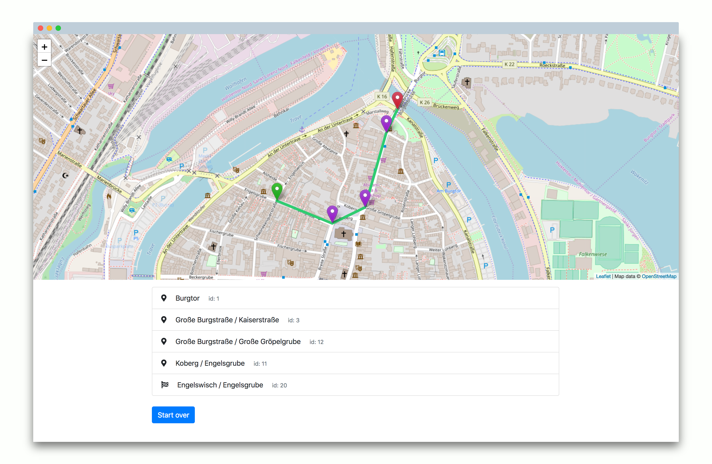

# Pathfinding in Lübeck 

> Find the shortest path in Lübeck City



Based on dijkstra algorithm.  
More information can be found [here](https://en.wikipedia.org/wiki/Dijkstra%27s_algorithm#Pseudocode).
Main algorithm can be found under `portal/pathfinding.py`.

## Test it out

Try this [demo](https://pathfindyr.herokuapp.com/) and test by yourself.
First loading may take a few seconds, because the server needs to wake up (free heroku tier).

## Requirements

- Python 2

## How to run this application on your system: 
 ```
 $ pip install -r requirements.txt
 $ python manage.py runserver
 ``` 
 Local dev server will start on port 8000.

 Enjoy!